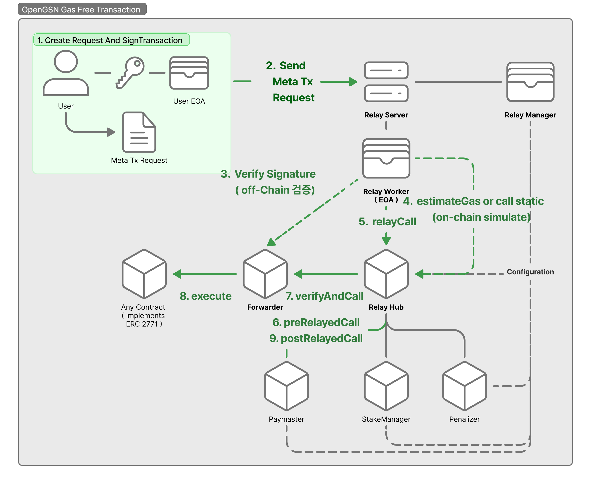

# OpenGSN Gas Free Transaction (Meta-Transaction)

- 이 저장소는 [OpenGSN (Gas Station Network)](https://docs.opengsn.org/)을 활용하여 사용자가 가스비(ETH) 없이도 블록체인과 상호작용할 수 있도록 하는 메타 트랜잭션 기능을 구현한 예제입니다.
- 이 예제에서는 `HardHat 테스트 환경`에서 별도의 `RelayServer` 구성 없이 `스마트 컨트랙트 레벨` 구현 및 테스트를 진행합니다.

## 🚀 OpenGSN이란?

- OpenGSN은 사용자가 이더리움 기반(**EVM**) 애플리케이션을 사용할 때 **ETH 없이도 트랜잭션을 전송할 수 있게 해주는 프로토콜**입니다.
- 사용자는 트랜잭션을 직접 보내는 것이 아니라, **서명된 메시지**를 relayer에게 보내고,
- relayer가 이를 블록체인에 대신 전송하며 가스비를 대납합니다.

## 🧩 주요 구성 요소

| 구성 요소          | 설명                                                                                                                                                                                                                              |
| ------------------ | --------------------------------------------------------------------------------------------------------------------------------------------------------------------------------------------------------------------------------- |
| `Relay Server`     | 사용자의 서명된 메시지를 받아 블록체인에 전송하는 서버입니다.                                                                                                                                                                     |
| `Relay Worker`     | `Relay Server` 에서 사용자의 `Meta Transaction` 에 대한 `Gas Fee`를 대납하는 EOA 입니다.                                                                                                                                          |
| `RelayHub`         | 리레이어 등록 및 수수료 정산을 처리하는 핵심 스마트 컨트랙트입니다.                                                                                                                                                               |
| `Paymaster`        | 어떤 트랜잭션에 대해 가스비를 지원할지 결정하는 계약입니다.                                                                                                                                                                       |
| `Forwarder`        | 원래 호출자가 누구인지 검증하고, 올바르게 호출되도록 지원합니다.                                                                                                                                                                  |
| `Meta-Transaction` | **사용자가 서명한 트랜잭션 데이터**를 다른 `제3자(릴레이 서버)`가 대신해서 **블록체인에 트랜잭션을 전송**해 주는 방식으로써, `사용자는 단지 트랜잭션에 서명`만 하고, `가스 비용을 직접 지불하지 않아도 되는` 트랜잭션 방식입니다. |

---

## 🧱 시스템 아키텍처

```text
[사용자] → [Relayer] → [Forwarder] → [Paymaster] → [RelayHub] → [타겟 스마트 컨트랙트]
```



# Off Chain 검증 & On Chain 검증

- ## Off Chain 검증

  - On-Chain 상태를 조회해서, Off-Chain 위치에서 서명된 요청의 유효성을 판단하는 과정

- ## On Chain 검증

  - 스마트 컨트랙트를 런타임 중, On-Chain 위에서 직접 상태를 읽어 유효성을 판단하는 과정

- ## On Chain 검증 vs Off Chain 검증

  | 항목        | On-Chain 검증                              | Off-Chain 검증                              |
  | ----------- | ------------------------------------------ | ------------------------------------------- |
  | 위치        | 스마트 컨트랙트 내부                       | Relay 서버, 클라이언트                      |
  | 근거 데이터 | 런타임 체인 상태 + 스마트 컨트랙트 로직    | 조회한 체인 상태 + 서버 또는 Client 로직    |
  | 실패 처리   | revert ( 트랜잭션 실패 )                   | 트랜잭션 거절 ( 제출 X )                    |
  | 유연성      | 낮음 ( 배포된 스마트 컨트랙트의 불변성 )   | 높음 (서버 또는 Client 검증 로직 수정 용이) |
  | 투명성      | 높음 ( 모든 검증 로직이 블록체인에 기록됨) | 낮음 ( 검증 로직은 체인 외부에서 실행됨 )   |
  | 보안        | 검증 기반                                  | 신뢰 기반                                   |

# GSN vs Trusted Forwarder

### OpenGSN – _검증 기반 메타트랜잭션 릴레이 시스템_

OpenGSN은 다음과 같은 특징을 가진 탈중앙화된 릴레이 네트워크입니다

```
1. 사용자가 서명된 요청 생성
2. 릴레이 서버가 off-chain에서 유효성 검사
3. relayWorker가 RelayHub.relayCall() 호출
4. RelayHub가 stake 검증 후 Forwarder.execute() 호출
5. Paymaster가 가스 수수료 환급
```

- 서명, 논스, Paymaster 로직 등을 스마트컨트랙트에서 온체인 검증
- 부정 행위를 검출하고 슬래싱하는 스테이킹 시스템
- 릴레이 로직과 수수료 정책의 분리
- 퍼블릭 체인과 같이 누구나 참여 가능한 환경에 적합

### Trusted Forwarder – _신뢰 기반 메타트랜잭션 릴레이 시스템_

Trusted Forwarder 방식은 다음과 같은 특징을 가집니다

```
1. 사용자가 서명된 요청 생성
2. 릴레이 서버가 off-chain에서 유효성 검사 (신뢰 기반)
3. 릴레이 서버가 Forwarder.execute() 직접 호출
4. 릴레이 서버가 자체 가스 대납 처리
```

- 사용자의 서명된 요청을 릴레이 서버가 수신
- 서버가 직접 Forwarder.execute()를 호출하여 트랜잭션 수수료를 대납
- 검증은 오직 서버 측에서만 수행
- 시스템 구조가 단순하고 구현이 쉬우며, Ava Cloud Subnet 등 제한된 환경에서 유용

| 항목                       | **OpenGSN**                                             | **Trusted Forwarder**           |
| -------------------------- | ------------------------------------------------------- | ------------------------------- |
| **시스템 유형**            | 검증 기반 (Verifiability-based)                         | 신뢰 기반 (Trust-based)         |
| **릴레이 호출 방식**       | RelayHub → Forwarder                                    | Forwarder 직접 호출             |
| **Stake / Slash 메커니즘** | 있음 (StakeManager, Penalizer)                          | 없음                            |
| **가스 수수료 처리**       | Paymaster가 온체인에서 처리                             | 서버에서 자체 처리              |
| **서명 및 논스 검증**      | Off-chain + On-chain 이중 검증                          | Off-chain에서만 검증            |
| **필요한 스마트컨트랙트**  | RelayHub, Forwarder, Paymaster, StakeManager, Penalizer | Forwarder만 필요                |
| **탈중앙성**               | 중간 (다수 relayWorker 운영 가능)                       | 낮음 (단일 서버 운영자)         |
| **주요 사용 사례**         | 공개 네트워크, 퍼블릭 dApp                              | Ava Cloud Subnet, 프라이빗 체인 |
| **보안 모델**              | 검증 가능성 기반                                        | 운영자에 대한 신뢰 기반         |

---
